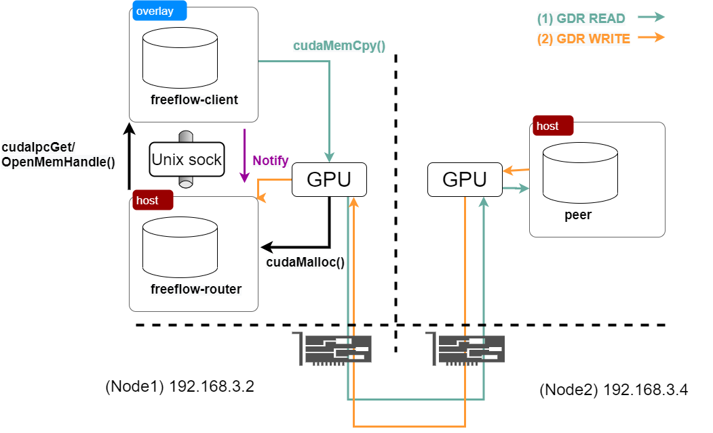
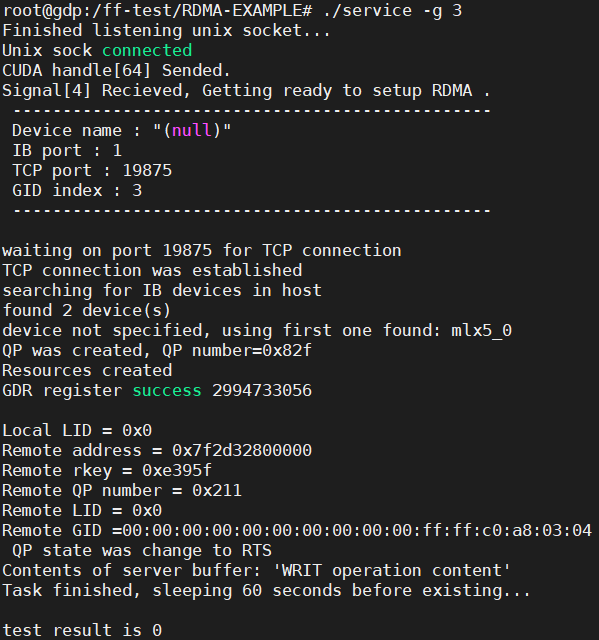
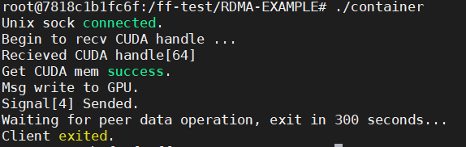
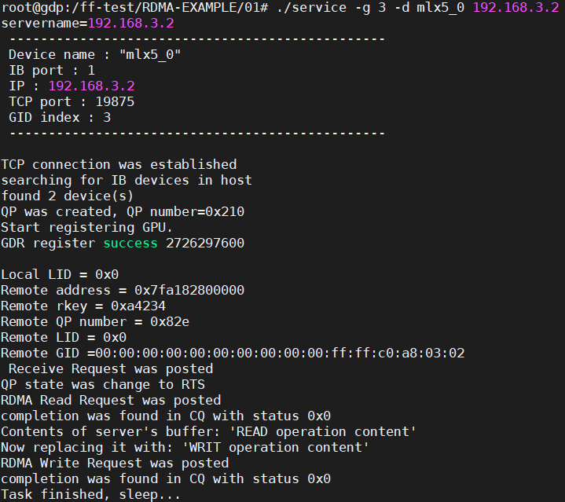

# FFRouter-GDR-Test
A simple test to see if it is possible for [FreeFlow](https://github.com/microsoft/Freeflow) router to work with GPU Direct RDMA (GDR)
## Conclusion
**Yes.**
***
## Requirements
```
docker, nivida docker support, cuda library (drivers also), libibverbs (drivers also). 
```
## Architecture

## Install
Configure Makefile.
```
gcc service.c -o service -g -I[path_to_your_cuda_include] -L[path_to_your_cuda_home]/lib64 -libverbs -lcudart
gcc container.c -o container -g -I[path_to_your_cuda_include] -L[path_to_your_cuda_home]/lib64 -libverbs -lcudart
```
Then **make**.
## Usage
Note that the following steps have to be carried out in the exact same order.
### 1. Launch corresponding containers.
We need three containers as shown in the figure. 
- Node1: freeflow-router
```
docker run  --runtime=nvidia --name freeflow-router --net host -p 19875:19875 -v /sys/class/:/sys/class/ -v /home/FFRouter-GDR-Test:/ff-test -v /dev/:/dev/ --privileged -it -d horovod1 /bin/bash
```
- Node1: freeflow-client
```
docker run  --runtime=nvidia --name freeflow-client --net weave -e --ipc=container:freeflow-router -v /sys/class/:/sys/class/ -v /home/FFRouter-GDR-Test:/ff-test -v /dev/:/dev/ --privileged -it -d horovod1 /bin/bash
```
- Node2: peer
```
docker run  --runtime=nvidia --name peer --net host -v /sys/class/:/sys/class/ -v /home/FFRouter-GDR-Test:/ff-test -v /dev/:/dev/ --privileged -it -d horovod1 /bin/bash
```
### 2. Run freeflow-router
Log into container:freeflow-router and run the corresponding procedure. The router will allocate GPU memory and get ready to send it to the freeflow-client. 
```
./service -g [choose a proper GID] -d [choose a proper device]
```
### 3. Run freeflow-client
Log into container:freeflow-client and run the corresponding procedure. The client gets GPU memory from router, copies data to the memory and then notify the router for RDMA communication.
```
./client
```
### 4. Run peer
Log into container:peer and run the corresponding procedure. The peer connects to the router and performs (1) GDR read; (2) GDR write.
```
./service -g [choose a proper GID] -d [choose a proper device] [IP of node1]
```
## Results
- On freeflow-router \

- On freeflow-client \

- On peer \

